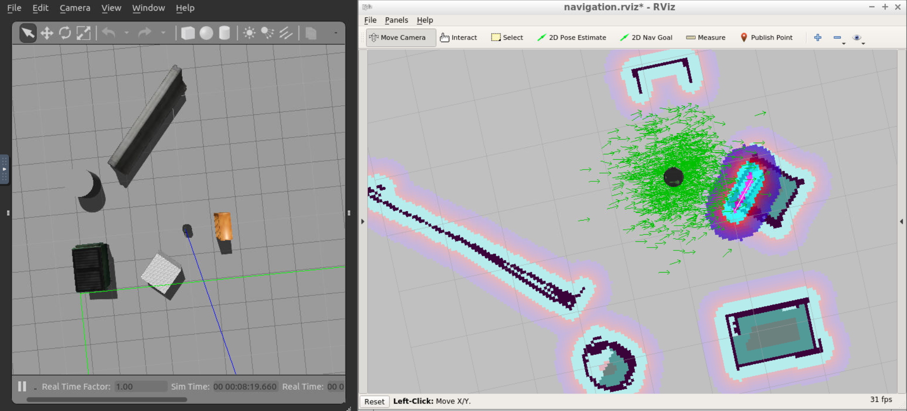
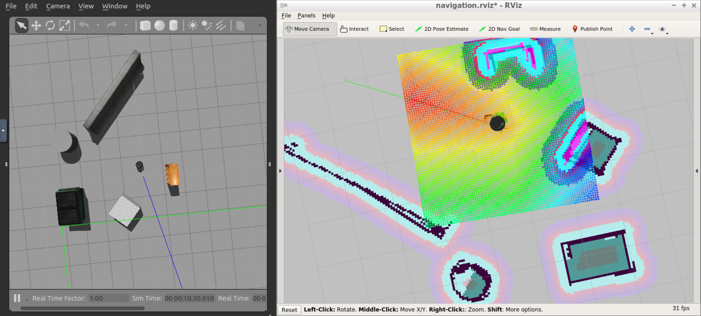
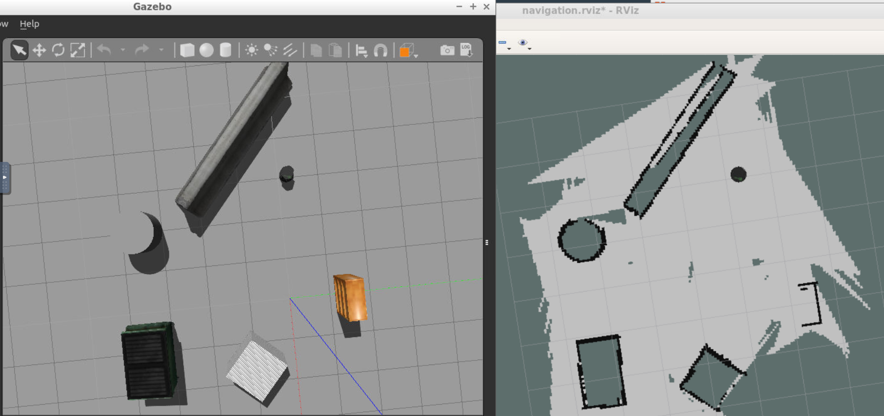

# Home_Service_Robot

The goal of this project is to program a robot that can autonomously map an environment and navigate to pick up and drop off virtual objects. 
There are a number of packages used in this project, detailed as follows. 

The official ROS packages used are gmapping, turtlebot_teleop, turtlebot_rviz_launchers, and turtlebot_gazebo. 
The [gmapping package](http://wiki.ros.org/gmapping) is used to perform SLAM and build a map of the environment with a robot equipped with laser range finder sensors and RGB-D cameras. 
The [turtlebot_teleop package](http://wiki.ros.org/turtlebot_teleop) allows the user to manually control the robot using keyboard commands. 
With the [turtlebot_rviz_launchers package](http://wiki.ros.org/turtlebot_rviz_launchers), a preconfigured RViz workspace is generated which automatically loads the robot model, trajectories, and map. 
The [turtlebot_gazebo package](http://wiki.ros.org/turtlebot_gazebo) deploys a turtlebot in the gazebo environment by linking the world file to it.

In addition to the official ROS packages detailed above, further packages have been added to this project to accomplish the overall goal. 
The map directory contains the Gazebo world file and the map generated from SLAM. The scripts directory stores the shell scripts used to run the program. 
Customised RViz configuration files are stored in the rvizConfig directory. The pick_objects and add_markers directories each contain C++ nodes which communicate with one another. 
The former controls and commands the robot to drive to the pick-up and drop-off zones, while the latter models the object with a marker in RViz.

## Screenshots
The robot performing autonomous navigation in the environment: 


Direct comparison between the simulation and generated map: 



## Building
Prerequisites/Dependencies: [Gazebo](http://gazebosim.org/) and ROS. 

With the prerequisites met, source global ros: 
```
$ source /opt/ros/<your_ros_version>/setup.bash
```
Create a catkin workspace:
```
$ mkdir -p catkin_ws/src && cd catkin_ws
```
Clone the driver:
```
$ git clone https://github.com/barrymulvey/Home_Service_Robot.git src/Home_Service_Robot
```
Install dependencies:
```
$ sudo apt update -qq
$ rosdep update
$ rosdep install --from-paths src --ignore-src -y
```
Install xterm (terminal emulator): 
```
$ sudo apt-get install xterm
```
Build the workspace:
```
$ catkin_make
```
Activate the workspace:
```
$ source devel/setup.bash
```

## Testing
Navigate to the shell scripts folder: 
```
$ cd src/scripts
```
Run either of the following shell scripts for testing purposes: 
1.	Launch the SLAM Testing shell script to map the environment: 
```
$ ./test_slam.sh
```
2.	Launch the Localization and Navigation Testing shell script to test the robot's ability to reach different goals and orient itself with respect to them: 
```
$ ./test_navigation.sh
```

## Launching
Navigate to the shell scripts folder: 
```
$ cd src/scripts
```
Run one of the following shell scripts: 
1.	Launch the Navigation Goal node which communicates with the ROS navigation stack and autonomously sends successive goals for the robot to reach: 
```
$ ./pick_objects.sh
```
2.	Launch the Virtual Objects node which models a virtual object – being picked up and delivered by the robot – with markers in RViz: 
```
$ ./add_markers.sh
```
3.	Launch the full Home Service Robot – running all the nodes in this project – capable of autonomously navigating to pick up and deliver virtual objects: 
```
$ ./home_service.sh
```

## Directory Structure
    ├──                                # Official ROS packages
    |
    ├── slam_gmapping                  # gmapping_demo.launch file                   
    │   ├── gmapping
    │   ├── ...
    ├── turtlebot                      # keyboard_teleop.launch file
    │   ├── turtlebot_teleop
    │   ├── ...
    ├── turtlebot_interactions         # view_navigation.launch file      
    │   ├── turtlebot_rviz_launchers
    │   ├── ...
    ├── turtlebot_simulator            # turtlebot_world.launch file 
    │   ├── turtlebot_gazebo
    │   ├── ...
    ├──                                # My packages and directories
    |
    ├── map                            # map files
    │   ├── ...
    ├── scripts                        # shell script files
    │   ├── ...
    ├──rvizConfig                      # RViz configuration files
    │   ├── ...
    ├──pick_objects                    # pick_objects C++ node
    │   ├── src/pick_objects.cpp
    │   ├── ...
    ├──add_markers                     # add_marker C++ node
    │   ├── src/add_markers.cpp
    │   ├── ...
    └──
